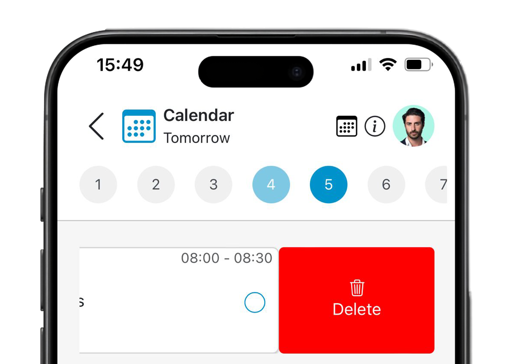

# DeltaPlan


DeltaPlan is the application we created for the `Human Computer Interaction` course, academic year 2023-24, on the topic of `Health & Wellbeing`.<br>
For a young adult who has recently started living on their own or is just inexperienced, managing their diet can be a challenging task. DeltaPlan is a useful tool that allows users to plan their meals and activities.

<p align="center">
  
  
</p>

<p align="center">
  
  
</p>

<p align="center">
  
  
</p>

## 📄 Project Report  
For a detailed analysis of the problem, design process, and usability testing of DeltaPlan, check out the full report:  
[Final Report](docs/Final_Report_GAF.pdf)

## Members
- Mangani Fabio s313373
- Medica Gabriele s317657
- Scamporrino Andrea s318927

## Server Side

### Running the Server

#### 1. `node`
To launch the server in production mode, use the following command:

```bash
npm start
```

#### 2. `nodemon`
To launch the server in production mode, use the following command:

```bash
npm run dev
```

### APIs

#### Ingredients

**1. Get All Ingredients**

**Description:**
Retrieve a list of ingredients, with an additional parameter `isUser` indicating whether each ingredient was added by the user or not.

**Request:**
- Method: `GET`
- Endpoint: `/api/ingredients`
- Request body: _None_

**Response:** `200 OK`
- Response body: 
```json
[
    {
        "id": 1,
        "name": "Flour",
        "isUser": false
    },
    {
        "id": 2,
        "name": "Sugar",
        "isUser": true
    },
    {
      "id": 3,
      "name": "Pineapple",
      "isUser": true
    },
    // Additional items...
]
```

**1. Get All Recipes given meal type**

**Description:**
Retrieve a list of recipes, with the related ingredients. Every ingredient has a `isPresent` field, indicating if it is present in the inventory.

**Request:**
- Method: `GET`
- Endpoint: `/api/recipes`
- query: `meal` = Breakfast, Lunch, Dinner or Snack 
- Request body: _None_
<br><br>**NOTE** call like this: `/api/recipes?meal=Breakfast`

**Response:** `200 OK`
- Response body: 
```json
[
  {  
    "id": 1,
    "name": "Recipe Name",
    "description": "short description",
    "ingredients": [
      {
        "name": "Flour",
        "quantity": 100,
        "unit_of_measure": "g",
        "isPresent": false
        /* display the chart if it is true */   
      },
      // Additional ingredients...
    ],
  }  
    // Additional items...
]
```
- Error Response: `400 Bad Request`

#### Inventory

**1. Get All Ingredients**

**Description:**
Retrieve the list of ingredients in the inventory.

**Request:**
- Method: `GET`
- Endpoint: `/api/inventory`
- Request body: _None_

**Response:** `200 OK`
- Response body: 
```json
[
    {
        "id": 1,
        "ingredient_name": "Sugar",
        "quantity": 100,
        "unit_of_measure": "grams",
        "expiration_date": null
    },
    {
        "id": 2,
        "ingredient_name": "Apple",
        "quantity": 2,
        "expiration_date": "YYYY-MM-DD"
    },
    // Additional items...
]
```

**2. Get First 3 Ingredients**

**Description:**
Retrieve a list containing the first three ingredients in the inventory.

**Request:**
- Method: `GET`
- Endpoint: `/api/inventory/first-three`
- Request body: _None_

**Response:** `200 OK`
- Response body: 
```json
[
    {
        "id": 1,
        "ingredient_name": "Sugar",
        "quantity": 500,
        "unit_of_measure": "grams"
    },
    {
        "id": 2,
        "ingredient_name": "Apple",
        "quantity": 2,
        "unit_of_measure": ""
    },
    {
        "id": 3,
        "ingredient_name": "Egg",
        "quantity": 3,
        "unit_of_measure": ""
    }
]
```
**3. Add Ingredient to Inventory**

**Description:** 
Add a new ingredient to the inventory.
  
**Request:**
- Method: `POST`
- Endpoint: `/api/inventory`
- Request body:
```json
  {
    "ingredient_name": "Salt",
    "quantity": 50,
    "unit_of_measure": "grams",
    "expiration_date": "2023-06-30"
  }
```

**Response:** `201 Created`
- Response body:

```json
  {
    "message": "Inventory item added successfully",
    "item": {
      "id": 15,
      "ingredient_id": 43,
      "quantity": 50,
      "unit_of_measure": "grams",
      "expiration_date": "YYYY-MM-DD"
    }
  }
```

- Other Response body:
```json
  {
    "message": "Inventory item updated successfully",
    "item": {
      "id": 15,
      "ingredient_id": 43,
      "quantity": 60,
      "unit_of_measure": "grams",
      "expiration_date": "YYYY-MM-DD"
    }
  }
```
- Error Response: `400 Bad Request`

**4. Update Ingredient of Inventory**

**Description:** 
Update an entry of the inventory.
  
**Request:**
- Method: `PUT`
- Endpoint: `/api/inventory/:itemId`
- Request parameters: `itemId = entry's Id`
- Request body:
```json
  {
    "ingredient_name": "Egg",
    "quantity": 1,
    "unit_of_measure": "",
    "expiration_date": "2023-06-30"
  }
```

**Response:** `200 OK`
- Response body:

```json
  {
    "message": "Inventory item updated successfully",
    "item": {
      "id": "3",
      "ingredient_id": 4,
      "quantity": 1,
      "unit_of_measure": "",
      "expiration_date": "YYYY-MM-DD"
    }
  }
```
- Error Response: `400 Bad Request`
- Error Response: `404 Not Found`

**5. Delete Ingredient from Inventory**

**Description:** 
Delete an entry of the inventory.
  
**Request:**
- Method: `DELETE`
- Endpoint: `/api/inventory/:itemId`
- Request parameters: `itemId = entry's Id`
- Request body: _None_

**Response:** `200 No Content`
- Response body:
```json
  {
    "message": "Item 1 has been deleted."
  }
```

- Error Response: `400 Bad Request`
- Error Response: `404 Not  Found`

#### Shopping List

**1. Get All Ingredients**

**Description:**
Retrieve the list of ingredients in the shopping list.

**Request:**
- Method: `GET`
- Endpoint: `/api/shopping-list`
- Request body: _None_

**Response:** `200 OK`
- Response body: 
```json
[
    {
    "id": 1,
    "ingredient_name": "Salt",
    "quantity": 100,
    "unit_of_measure": "grams",
    "buy_by_date": null
  },
  {
    "id": 2,
    "ingredient_name": "Flour",
    "quantity": 200,
    "unit_of_measure": "grams",
    "buy_by_date": "YYYY-MM-DD"
  },
    // Additional items...
]
```

**2. Get Nearest 3 Ingredients**

**Description:**
Retrieve a list containing the first three ingredients in the shopping list to be bought.

**Request:**
- Method: `GET`
- Endpoint: `/api/shopping-list/nearest-three`
- Request body: _None_

**Response:** `200 OK`
- Response body: 
```json
[
    {
        "id": 1,
        "ingredient_name": "Greek Yogurt",
    },
    {
        "id": 2,
        "ingredient_name": "Blueberries",
    },
    {
        "id": 3,
        "ingredient_name": "Bananas",
    }
]
```
**3. Add Ingredient to Shopping List**

**Description:** 
Add a new ingredient to the shopping list.
  
**Request:**
- Method: `POST`
- Endpoint: `/api/shopping-list`
- Request body:
```json
  {
    "ingredient_name": "Salt",
    "quantity": 50,
    "unit_of_measure": "grams",
    "buy_by_date": "2023-06-30"
  }
```

**Response:** `201 Created`
- Response body:

```json
  {
    "message": "Shopping List item added successfully",
    "item": {
      "id": 15,
      "ingredient_id": 43,
      "quantity": 50,
      "unit_of_measure": "grams",
      "buy_by_date": "YYYY-MM-DD"
    }
  }
```

- Other Response body:
```json
  {
    "message": "Shopping List item updated successfully",
    "item": {
      "id": 15,
      "ingredient_id": 43,
      "quantity": 60,
      "unit_of_measure": "grams",
      "buy_by_date": "YYYY-MM-DD"
    }
  }
```
- Error Response: `400 Bad Request`

**4. Update Ingredient of Shopping List**

**Description:** 
Update an entry of the shopping list.
  
**Request:**
- Method: `PUT`
- Endpoint: `/api/shopping-list/:itemId`
- Request parameters: `itemId = entry's Id`
- Request body:
```json
  {
    "ingredient_name": "Egg",
    "quantity": 1,
    "unit_of_measure": "",
    "buy_by_date": "2023-06-30"
  }
```

**Response:** `200 OK`
- Response body:

```json
  {
    "message": "Shopping List item updated successfully",
    "item": {
      "id": "3",
      "ingredient_id": 4,
      "quantity": 1,
      "unit_of_measure": "",
      "buy_by_date": "YYYY-MM-DD"
    }
  }
```
- Error Response: `400 Bad Request`
- Error Response: `404 Not  Found`

**5. Delete Ingredient from Shopping List**

**Description:** 
Delete an entry of the shopping list.
  
**Request:**
- Method: `DELETE`
- Endpoint: `/api/shopping-list/:itemId`
- Request parameters: `itemId = entry's Id`
- Request body: _None_

**Response:** `200 No Content`
- Response body:
```json
  {
    "message": "Item 1 has been deleted."
  }
```

- Error Response: `400 Bad Request`
- Error Response: `404 Not  Found`

**6. Add Ingredient to Shopping List**

**Description:** 
Delete an entry of the shopping list and insert it into the inventory.
  
**Request:**
- Method: `POST`
- Endpoint: `/api/shopping-list/bought/:itemId`
- Request parameters: `itemId = entry's Id` 
- Request body: _None_

**Response:** `200 OK`
- Response body:
```json
  {
    "message": "Shopping List Item :itemId eliminated, Inventory item added successfully",
    "item": {
      "id": 16,
      "ingredient_id": 2,
      "quantity": 30,
      "unit_of_measure": "grams",
      "expiration_date": null
    }
  }
```
- Error Response: `400 Bad Request`
- Error Response: `404 Not Found`

#### Activities

**1. Get All Activities for a given Date**

**Description:**
Retrieve the list of activities given a date as query parameter (for simplicity we assumed that if it is called without any date, it refers to today).

**Request:**
- Method: `GET`
- Endpoint: `/api/activities`
- query: `date` = YYYY-MM-DD
- Request body: _None_
<br><br>**NOTE** call like this: `/api/activities?meal=2024-01-01`

**Response:** `200 OK`
- Response body: 
```json
[
  {
    "id": 1,
    "start_time": "08:00:00",
    "end_time": "09:00:00",
    "type": "meal", 
    /* type could be either "meal" or "general" */
    "repeat": "d",
    /* repeat could be either "d", "w", "m", "n" */ 
    "meal_type": "Breakfast",
    "recipes": [
      {
        "recipe_id": 1,
        "name": "Classic Pancakes",
        "description": "short description",
        "path": "recipes/path",
        "ingredients": [
          {
            "ingredient_id": 1,
            "name": "Flour",
            "quantity": 100,
            "unit_of_measure": "g",
            "isPresent": false
          },
          // Additional Ingredients
        ]
      },
      // Additional Recipes
    ],    
    "other_ingredients": [
      {
        "ingredient_id": 1,
        "name": "Flour",
        "isPresent": true
        /* display the chart if it is true */
      },
      // Additional Ingredients
    ],
    "done": true, // done value means if the activity has been completed
    /* meal_type, recipes and other_ingredients are defined when type is "meal" */
  },
  {
    "id": 3,
    "start_time": "18:00:00",
    "end_time": "19:00:00",
    "type": "general",
    /* type could be either "meal" or "general" */
    "title": "Gym",
    "notes": "Leg day",
    "done": false, // done value means if the activity has been completed
    /* title and notes are defined when type is "general" */
  },    
    // Additional items...
]
```

**2. Get Nearest 3 Activities**

**Description:**
Retrieve a list at most 3 activities of today, based on the current time.

**Request:**
- Method: `GET`
- Endpoint: `/api/activities/first-three`
- Request body: _None_

**Response:** `200 OK`
- Response body: 
```json
[
  {
    "id": 1,
    "start_time": "08:00:00",
    "end_time": "09:00:00",
    "type": "meal", 
    /* type could be either "meal" or "general" */
    "repeat": "d",
    /* repeat could be either "d", "w", "m", "n" */ 
    "meal_type": "Breakfast",
    "recipes": [
      {
        "recipe_id": 1,
        "name": "Classic Pancakes",
        "description": "short description",
        "path": "recipes/path",
        "ingredients": [
          {
            "ingredient_id": 1,
            "name": "Flour",
            "quantity": 100,
            "unit_of_measure": "g",
            "isPresent": false
          },
          // Additional Ingredients
        ]
      },
      // Additional Recipes
    ],    
    "other_ingredients": [
      {
        "ingredient_id": 1,
        "name": "Flour",
        "isPresent": true
        /* display the chart if it is true */
      },
      // Additional Ingredients
    ],
    "done": true, // done value means if the activity has been completed
    /* meal_type, recipes and other_ingredients are defined when type is "meal" */
  },
  {
    "id": 3,
    "start_time": "18:00:00",
    "end_time": "19:00:00",
    "type": "general",
    /* type could be either "meal" or "general" */
    "title": "Gym",
    "notes": "Leg day",
    "done": false, // done value means if the activity has been completed
    /* title and notes are defined when type is "general" */
  },    
  // At most one other item ...
]
```

**3. Add Activity**

**Description:** 
Add a new activity, then add missing ingredients to the shopping list automatically.
  
**Request:**
- Method: `POST`
- Endpoint: `/api/activities`
- Request body:
```json
  {
    "start_time": "HH:MM:SS", //seconds not needed
    "end_time": "HH:MM:SS",
    "date": "YYYY-MM-DD",
    "repeat": "n", // must be "n", "d", "w" or "m"
    "type": "meal", // must be "meal" or "general"
    "title": "prova", // Only if type equals to "general"
    "notes": "some notes", // Only if type equals to "general"
    "meal_type": "Lunch", // Only if type equals to "meal"
    "recipes": [1, 3], // Only if type equals to "meal", it must contain the id of the recipe
    "other_ingredients": [{"name": "straw", "quantity": 2, "unit_of_measure": ""}, {"name": "2", "quantity": 2, "unit_of_measure": "g"}] // Only if type equals to "meal", it must contain objects containing the name of the ingredient, its quantity and unit of measure
  }
```

**Response:** `201 Created`
- Response body:
```json
  {
  "message": "Activity 4 has been successfully created."
  }
```
- Error Response: `400 Bad Request`

**4. Update Activity**

**Description:** 
Update an existing activity, managing ingredients present in the shopping list.

**Request:**
- Method: `PUT`
- Endpoint: `/api/activities/:itemId`
- Request parameters: `itemId = entry's Id`
- Request body:
```json
  {
    "start_time": "HH:MM:SS", //seconds not needed
    "end_time": "HH:MM:SS",
    "date": "YYYY-MM-DD",
    "repeat": "n", // must be "n", "d", "w" or "m"
    "type": "meal", // must be "meal" or "general"
    "title": "prova", // Only if type equals to "general"
    "notes": "some notes", // Only if type equals to "general"
    "meal_type": "Lunch", // Only if type equals to "meal"
    "recipes": [1, 3], // Only if type equals to "meal", it must contain the id of the recipe
    "other_ingredients": [{"name": "straw", "quantity": 2, "unit_of_measure": ""}, {"name": "2", "quantity": 2, "unit_of_measure": "g"}] // Only if type equals to "meal", it must contain objects containing the name of the ingredient, its quantity and unit of measure
  }
```

**Response:** `200 Ok`
- Response body:

```json
  {
    "message": "Activity has been successfully modified.",
  }
```
- Error Response: `400 Bad Request`
- Error Response: `400 Not Found`

**5. Delete Activity**

**Description:** 
Delete an Activity with the missing ingredients added to the shopping list.
  
**Request:**
- Method: `DELETE`
- Endpoint: `/api/activities/:itemId`
- Request parameters: `itemId = entry's Id`
- Request body: _None_

**Response:** `200 Ok`
- Response body:
```json
  {
    "message": "Activity 1 has been deleted."
  }
```

- Error Response: `400 Bad Request`
- Error Response: `404 Not Found`

**6. Set Activity as Done**

**Description:** 
It sets an activity as done for a certain date, then update the inventory.
  
**Request:**
- Method: `POST`
- Endpoint: `/api/activities/:itemId/done`
- Request parameters: `itemId = entry's Id`
- Request body:
```json
  {
    "date": "YYYY-MM-DD",
  }
```

**Response:** `200 Ok`
- Response body:

```json
  {
    "message": "Activity 1 has been set as done.",
  }
```
- Error Response: `400 Bad Request`
- Error Response: `404 Not Found`